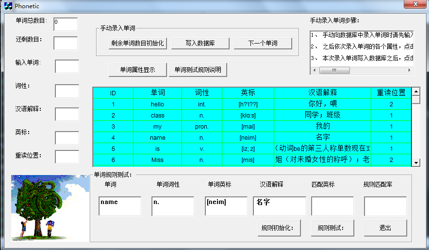
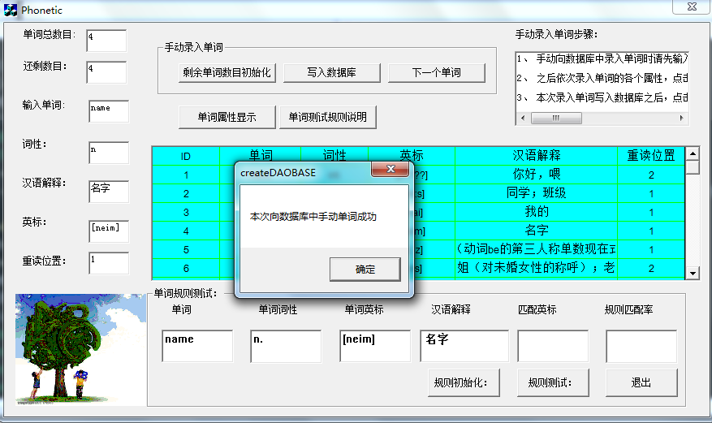
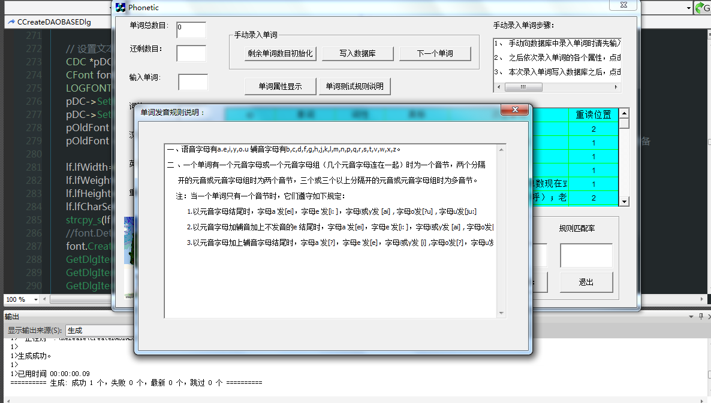

#PhoneticRule

* 这是一个一个音标规则测试Project,完成一套英语音标发音规则的测试.
##项目背景:
> 一位英语机构的老师根据自己多年英语教学的亲身经验,发现了一套英语发音规则,为了更好的将这套英语音标的发音规则应用于实际教学,
    也为了验证他发现的这套规则是否具有普遍性和真确性,这就是程序的开发背景.

##开发平台和环境:
+ Windows+VS2010+音标数据库.

##功能介绍:

> 实现数据库单词属性的手动录入,单词数据属性的显示,以及规则查找,规则查找采用了字符串匹配算法中的BF算法和KMP算法的思想,
对算法细节有所改动,关键模块操作如下:
首先手动录入单词名称,然后根据查找规则匹配数据库中的单词,如果查找到单词,则根据实现规定的好的规则,即单词字母的元輔音,
重读位置,单元音,双元音,多元音等等约定好的规则,动态匹配生成对应输入单词的英标,之后计算计算音标的匹配率,如果某个规则
在某种情况下,比如在单词末尾发什么音的比率大于百分之七十,则说明此规则具有一般性和普遍性,否则则不具有普遍性.

##界面

**界面整体布局**

**数据库录入**

**规则说明窗口**

